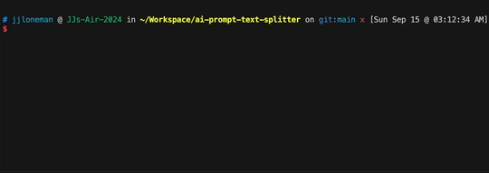

# ✂️ AI Prompt Text Splitter


> A node.js/typescript program that splits text into tokens that fit into an AI
> prompt, like ChatGPT.

## 🛠️ Setup

```sh
# Cloning
git clone git@github.com:jjloneman/ai-prompt-text-splitter.git

# Installing
cd ai-prompt-text-splitter
npm install
```

## 👟 Running

1. Replace the text in [./input.txt](./index.txt) with the text you want to
   split

2. Run the script to interactively copy each chunk to the clipboard:

   ```sh
   npm start
   ```

   [](./docs/run-demo.gif)
